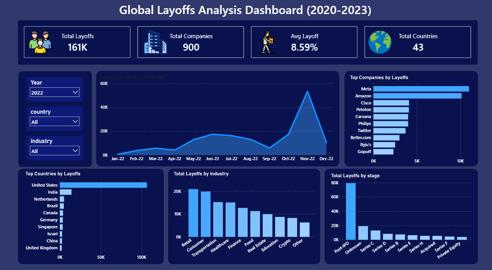

# 🌍 Global Layoffs Analysis Dashboard (2020–2023)



---

## 📊 Project Overview
The **Global Layoffs Analysis Dashboard** provides a comprehensive analysis of layoffs trends across the world from **2020 to 2023**.

This project focuses on transforming raw layoffs data into meaningful insights using:
- 🧹 SQL for data cleaning and preprocessing  
- 📊 Data analysis techniques  
- 📈 Interactive dashboard for visualization  

---

## 🧰 Tech Stack
- **SQL** – Data cleaning and transformation  
- **Power BI / Tableau** – Dashboard and visualization  
- **Excel / CSV** – Data source  
- **Dataset Source** – Kaggle / Layoffs.fyi  

---

## 🧹 Data Cleaning (SQL)

The raw dataset contained inconsistencies, duplicates, and missing values. SQL was used to prepare the dataset for analysis.

### 🔧 Cleaning Steps
- Removed duplicate rows  
- Handled NULL and missing values  
- Standardized company, country, and industry names  
- Converted date format  
- Extracted **Year** and **Month** columns  
- Filtered invalid or inconsistent records  

### 💻 SQL Code

```sql
-- Identify duplicates
SELECT *,
ROW_NUMBER() OVER (
    PARTITION BY company, location, total_laid_off, date
) AS row_num
FROM layoffs;

-- Delete duplicate rows
DELETE FROM layoffs
WHERE row_num > 1;

-- Handle NULL values
UPDATE layoffs
SET industry = 'Unknown'
WHERE industry IS NULL;

-- Extract year and month
SELECT 
    date,
    YEAR(date) AS year,
    MONTH(date) AS month
FROM layoffs;

-- Standardize country names
UPDATE layoffs
SET country = 'United States'
WHERE country IN ('USA', 'US', 'U.S.');
```

## 📈 Dashboard Features

### 🔢 Key Metrics
- **Total Layoffs:** 161K  
- **Total Companies:** 900  
- **Average Layoff Percentage:** 8.59%  
- **Total Countries Affected:** 43  

### 📅 Time-Series Analysis
- Monthly layoffs trend visualization  
- Peak layoffs observed in **November 2022**  

### 🏢 Top Companies by Layoffs
- Meta  
- Amazon  
- Cisco  
- Peloton  
- Carvana  
- Philips  
- Twitter  

### 🌍 Top Countries by Layoffs
- United States (dominates significantly)  
- India  
- Netherlands  
- Brazil  
- Canada  
- Germany  

### 🏭 Layoffs by Industry
- Retail  
- Consumer  
- Transportation  
- Healthcare  
- Finance  
- Real Estate  
- Education  
- Crypto  

### 💰 Layoffs by Funding Stage
- Post-IPO (highest layoffs)  
- Unknown  
- Series C  
- Series D  
- Series B  
- Acquired  
- Private Equity  

---

## 📌 Key Insights

- 📉 Layoffs surged sharply in late 2022, with a major spike in November  
- 🇺🇸 United States accounts for the majority of layoffs globally  
- 🏢 Big tech companies contributed heavily to layoffs  
- 💼 Post-IPO companies experienced the highest layoffs, indicating restructuring after growth phases  
- 🏭 Retail and Consumer industries were the most impacted sectors  
- 🌍 Layoffs were observed across 43 countries, showing global economic impact  

---

## 🚀 How to Use

### 1. Clone the Repository
```bash
git clone https://github.com/your-username/global-layoffs-dashboard.git
```
### 3. Open Files
- SQL scripts → `/sql/data_cleaning.sql`  
- Dashboard → `/dashboard/`  
- Dataset → `/data/`  

### 4. Run Dashboard
- Open `.pbix` file in **Power BI**  
- OR open `.twbx` file in **Tableau**  

## 📁 Project Structure

```bash
global-layoffs-dashboard/
│
├── data/
│   └── raw_layoffs.csv
│
├── sql/
│   └── data_cleaning.sql
│
├── dashboard/
│   └── layoffs_dashboard.pbix
│
├── images/
│   └── dashboard.png
│
└── README.md
```
## 📷 Dashboard Preview


---

## 🎯 Future Improvements
- Add real-time data updates  
- Build a web-based dashboard (Streamlit / React)  
- Include predictive analysis for layoffs trends  
- Add more filters (company size, revenue, etc.)  

---

## 🤝 Contributing

Contributions are welcome!

If you'd like to improve this project:
- Fork the repository  
- Create a new branch  
- Submit a pull request  

---

## 📜 License
This project is licensed under the **MIT License**.

---

## 🙌 Acknowledgements
- Dataset: Layoffs.fyi / Kaggle  
- Inspiration: Data analytics community  
